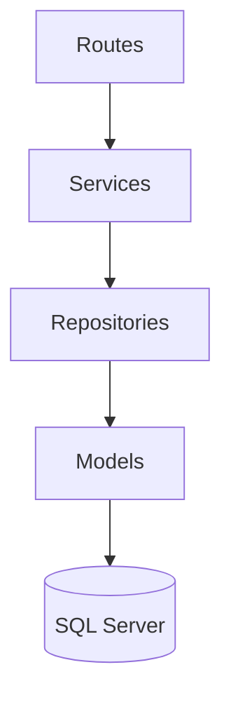
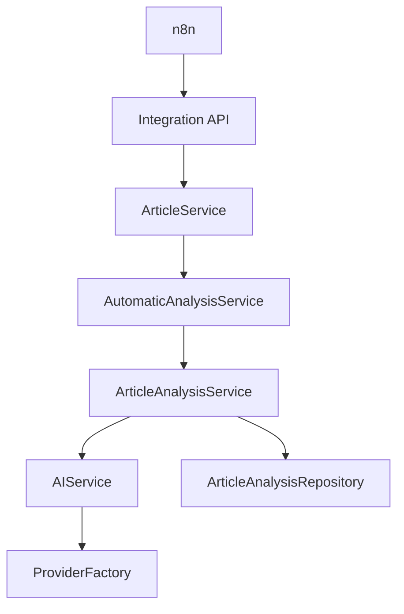
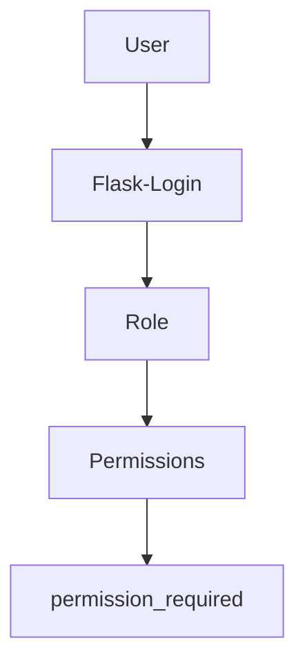
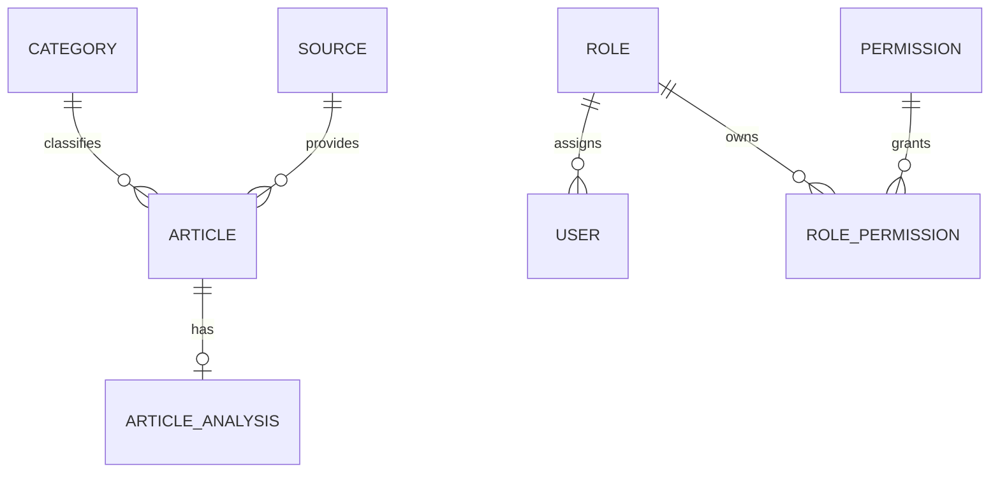

# Architecture

## Application layers

```mermaid
flowchart TD
    Routes[Routes] --> Services[Services]
    Services --> Repositories[Repositories]
    Repositories --> Models[Models]
    Models --> SQL[(SQL Server)]
```

## Automatic article creation

```mermaid
flowchart TD
    N8N[n8n] --> Integration[Integration API]
    Integration --> ArticleService
    ArticleService --> AutomaticAnalysisService
    AutomaticAnalysisService --> ArticleAnalysisService
    ArticleAnalysisService --> AIService
    AIService --> ProviderFactory
    ArticleAnalysisService --> ArticleAnalysisRepository
```

## Authentication and RBAC

```mermaid
flowchart TD
    User --> FlaskLogin[Flask-Login]
    FlaskLogin --> Role
    Role --> Permissions
    Permissions --> PermissionRequired[permission_required]
```

## Main data model

```mermaid
erDiagram
    ARTICLE ||--o| ARTICLE_ANALYSIS : has
    CATEGORY ||--o{ ARTICLE : classifies
    SOURCE ||--o{ ARTICLE : provides
    ROLE ||--o{ USER : assigns
    ROLE ||--o{ ROLE_PERMISSION : owns
    PERMISSION ||--o{ ROLE_PERMISSION : grants
```
